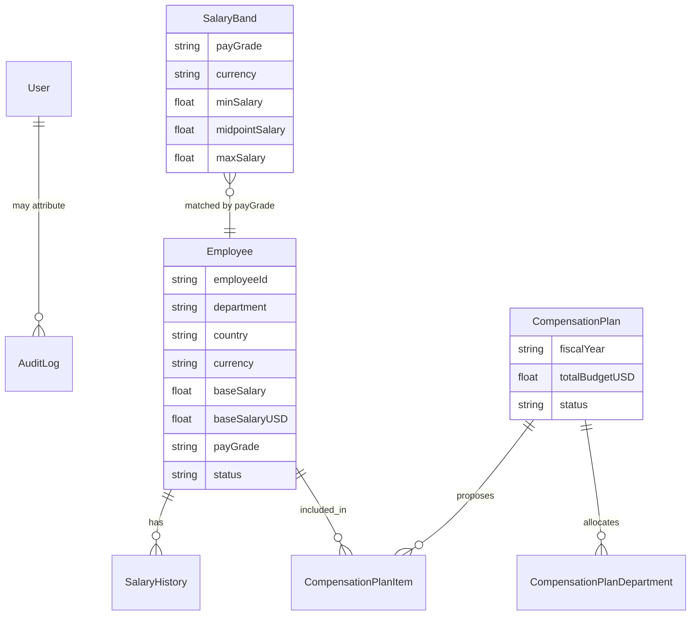

# ACME Salary Management — Architecture

> Describes the **shipped** system. Feature inventory: [`../PRODUCT_OVERVIEW.md`](../PRODUCT_OVERVIEW.md).

## 1. High-level stack

```text
┌─────────────────────────────────────────────────────────────┐
│  Browser (React 18 + Tailwind + Recharts)                   │
│  Client views, providers, modals/drawers, charts            │
└───────────────────────────┬─────────────────────────────────┘
                            │ HTTPS
┌───────────────────────────▼─────────────────────────────────┐
│  Next.js 14 App Router                                      │
│  • Middleware: JWT cookie gate (pages + /api)               │
│  • Server Components / Suspense streaming shells            │
│  • Server Actions (auth, some mutations)                    │
│  • Route Handlers REST API under src/app/api/*              │
│  • Service layer src/lib/* (domain logic)                   │
└───────────────────────────┬─────────────────────────────────┘
                            │ Prisma Client
┌───────────────────────────▼─────────────────────────────────┐
│  SQLite (prisma/dev.db)                                     │
│  Employee, SalaryHistory, User, SalaryBand,                 │
│  CompensationPlan (+ Department, Item), AuditLog            │
└─────────────────────────────────────────────────────────────┘
```

## 2. Request / auth flow

```mermaid
flowchart LR
  U[HR Manager] --> M[Next.js Middleware]
  M -->|no/invalid JWT| L[/login]
  M -->|valid JWT| P[App pages]
  M -->|valid JWT| A[/api routes]
  P --> SC[Server Components / Actions]
  A --> SVC[src/lib services]
  SC --> SVC
  SVC --> DB[(SQLite via Prisma)]
```

- Login: bcrypt verify → JWT (`jose`, HS256, 24h) → HTTP-only `auth_token` cookie.
- Middleware rejects unauthenticated page and API traffic.
- Profile updates via Server Actions; logout clears cookie.

## 3. Application module map

```text
src/
  app/                 # Routes: /, /people, /salary-bands,
                       #   /compensation-analytics, /compensation-planning,
                       #   /audit-log, /login + API route handlers
  actions/             # Server Actions (auth, employees, bands, adjustments)
  components/          # UI by domain + shared ui/layout/providers
  lib/                 # Domain services (analytics, planning, bands,
                       #   adjustments, audit, dashboard, prisma)
  constants/ types/    # Shared enums, nav, types
prisma/                # schema + seed scripts
src/__tests__/         # Vitest: bands, adjustments, analytics, planning
```

## 4. Data model (shipped)



Indexes on Employee (department, country, payGrade, status, salary, etc.) support filtered lists and aggregations at 10k rows.

## 5. UI architecture pattern

For heavy list pages (People, Bands, Planning, Analytics):

1. **Instant shell** — header/filters render immediately.
2. **Suspense boundary** — data fetcher streams in with skeletons.
3. **Provider** — client state for modals/selection without refetching the shell.
4. **Server aggregation** — charts/metrics computed in services, not in the browser over full tables.

## 6. API surface (shipped)

| Area | Routes |
|------|--------|
| Employees | `/api/employees`, `/api/employees/[id]/salary-adjustments` |
| Bands | `/api/salary-bands`, `/api/salary-bands/[id]` |
| Analytics | `/api/compensation-analytics` |
| Planning | `/api/compensation-planning` (+ `[id]`, status, departments, items, bulk-update, scenarios) |
| Audit | `/api/audit-logs`, `/api/audit-logs/[id]` |

## 7. Why this shape

- **Next.js monolith** keeps UI + API + auth in one deployable unit (assessment readiness).
- **Service layer** keeps money math testable without mounting the full UI.
- **SQLite** matches the “relational DB of your choice” constraint and simplifies seed/deploy for a demo.
- **Streaming SSR** keeps the 10k-employee UX feeling responsive without loading the full dataset client-side.
